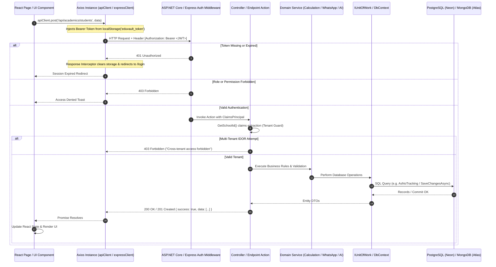

# ⚡ EduVault — API Request / Response Architecture & Pipeline Flow

> **Generated:** September 2026  
> **Source Code Trace:** Mapped from `apiClient.js`, `expressClient`, ASP.NET Core Middleware, JWT claims authentication, Controller filters, and EF Core / MongoDB operations.

---

## 🔄 End-to-End Pipeline Architecture

---

## 📡 Complete Controller & Endpoint Mapping

### 1. Authentication & Public Gateway (`/api/auth`)
| Method | Endpoint | Auth | Purpose | Database Entities |
| :--- | :--- | :--- | :--- | :--- |
| `POST` | `/api/auth/login` | Anonymous | Authenticates credentials, verifies PBKDF2 hash, issues JWT token with claims (`nameid`, `email`, `role`, `schoolId`), returns user DTO + permissions | `Users`, `Schools`, `PlatformSettings`, `SchoolRolePermissions` |
| `POST` | `/api/auth/register-school` | Anonymous | Onboards new school, creates default admin user, generates standard 1-year subscription | `Schools`, `Users`, `Subscriptions` |
| `POST` | `/api/auth/forgot-password` | Anonymous | Issues 256-bit CSPRNG token, stores SHA-256 hash with 15-min expiry | `Users`, `PasswordResetTokens` |
| `POST` | `/api/auth/reset-password` | Anonymous | Verifies SHA-256 hash, updates password with PBKDF2-SHA512 | `Users`, `PasswordResetTokens` |
| `GET` | `/api/auth/settings` | Anonymous | Returns public platform branding, colors, maintenance mode status | `PlatformSettings` (Cached 10 min) |
| `GET` | `/api/auth/school-branding` | Anonymous | Returns school logo, name, and theme color by domain | `Schools` |
| `GET` | `/api/auth/public-stats` | Anonymous | Returns total active schools, students, teachers, and revenue | `Schools`, `Users`, `Transactions` |
| `POST` | `/api/auth/submit-inquiry` | Anonymous | Submits contact or demo request from landing page | `SupportTickets` |

---

### 2. Super Admin Control Gateway (`/api/super`)
| Method | Endpoint | Auth | Purpose | Database Entities |
| :--- | :--- | :--- | :--- | :--- |
| `GET` | `/api/super/schools` | `superadmin` | Returns all onboarded schools with student counts and admin contact info | `Schools`, `Users` |
| `POST` | `/api/super/schools` | `superadmin` | Creates new school tenant with school code and admin credentials | `Schools`, `Users`, `Subscriptions` |
| `PUT` | `/api/super/schools/:id/status` | `superadmin` | Updates school status (`Active`, `Pending`, `Suspended`) | `Schools` |
| `PUT` | `/api/super/schools/:id/modules` | `superadmin` | Toggles school modules (`HasAccountModule`, `HasLibraryModule`, `HasReceptionistModule`) | `Schools` |
| `POST` | `/api/super/impersonate-school/:schoolId` | `superadmin` | Generates temporary schooladmin JWT token for live tenant inspection | `Schools`, `Users` |
| `GET` | `/api/super/stats` | `superadmin` | Global telemetry: total schools, MRR, student count, open tickets | `Schools`, `Users`, `Subscriptions`, `Transactions` |
| `GET` | `/api/super/health-stats` | `superadmin` | Platform health: DB latency, uptime, server metrics | System Diagnostics |
| `GET` | `/api/super/subscriptions` | `superadmin` | Returns all school subscriptions, start/end dates, plan tiers | `Subscriptions`, `Schools` |
| `GET` | `/api/super/upgrade-requests` | `superadmin` | Lists school plan upgrade applications | `UpgradeRequests`, `Schools` |
| `POST` | `/api/super/upgrade-requests/:id/approve` | `superadmin` | Approves plan upgrade, activates new limits | `UpgradeRequests`, `Subscriptions` |
| `POST` | `/api/super/upgrade-requests/:id/reject` | `superadmin` | Rejects plan upgrade with feedback | `UpgradeRequests` |
| `GET` | `/api/super/settings` | `superadmin` | Global settings, payment keys, SMS gateways, maintenance switch | `PlatformSettings` |
| `POST` | `/api/super/settings` | `superadmin` | Updates global platform parameters | `PlatformSettings` |

---

### 3. Super Admin HRM Hub (`/api/super/schools/:schoolId/hrm`)
| Method | Endpoint | Auth | Purpose | Database Entities |
| :--- | :--- | :--- | :--- | :--- |
| `GET` | `/overview` | `superadmin` | Loads full HRM configuration for selected school | `Departments`, `Designations`, `WorkSchedules`, `LeavePolicies`, `SalaryComponents` |
| `POST` | `/departments` | `superadmin` | Creates school department | `Departments` |
| `POST` | `/designations` | `superadmin` | Creates school designation | `Designations` |
| `PUT` | `/work-schedule` | `superadmin` | Updates school weekly working days & shift hours | `WorkSchedules` |
| `POST` | `/leave-policies` | `superadmin` | Defines leave types (Casual, Sick, Maternity) & carry-forward limits | `LeavePolicies` |
| `POST` | `/salary-components` | `superadmin` | Configures earnings & deductions (Basic, HRA, DA, Special) | `SalaryComponents` |
| `POST` | `/statutory/:type` | `superadmin` | Configures statutory rules (PF 12%, ESI 0.75%/3.25%, Professional Tax) | `StatutoryConfigurations` |
| `POST` | `/preview-calculation` | `superadmin` | Simulates salary breakdown for a given gross pay & attendance | In-Memory Computation Engine |

---

### 4. Academics, Students & Staff Gateway (`/api/academics`)
| Method | Endpoint | Auth | Purpose | Database Entities |
| :--- | :--- | :--- | :--- | :--- |
| `GET` | `/api/academics/classes` | Authorized | Returns classes, sections, and assigned class teachers | `Classes`, `Sections`, `Teachers` |
| `POST` | `/api/academics/classes` | `schooladmin` | Creates new class grade and section | `Classes`, `Sections` |
| `GET` | `/api/academics/students` | Authorized | Returns filtered student directory by class and search query | `Students`, `Users`, `Classes` |
| `POST` | `/api/academics/students` | `schooladmin` | Creates student record with auto-generated roll no & credentials | `Students`, `Users` |
| `PUT` | `/api/academics/students/:id` | `schooladmin` | Updates student profile & guardian contact details | `Students`, `Users` |
| `DELETE` | `/api/academics/students/:id` | `schooladmin` | Soft-deactivates student record | `Students`, `Users` |
| `GET` | `/api/academics/students/:id/clearance-check` | `schooladmin` | Verifies pending fee balances and unreturned library books | `Invoices`, `LibraryTransactions` |
| `POST` | `/api/academics/students/:id/generate-tc` | `schooladmin` | Generates official Transfer Certificate (TC) and marks student Alumnus | `Students`, `PrintTemplates` |
| `POST` | `/api/academics/students/:id/promote` | `schooladmin` | Promotes student to next academic session & grade | `Students`, `Enrollments` |
| `POST` | `/api/academics/students/:id/retain` | `schooladmin` | Retains student in current grade for new session | `Students`, `Enrollments` |
| `GET` | `/api/academics/teachers` | Authorized | Returns faculty roster with assigned subjects & qualifications | `Teachers`, `Users` |
| `POST` | `/api/academics/teachers` | `schooladmin` | Adds new teacher and credentials | `Teachers`, `Users` |
| `GET` | `/api/academics/attendance/class/:classId` | `teacher`, `schooladmin` | Returns student attendance roster for selected date | `Attendances`, `Students` |
| `POST` | `/api/academics/attendance/submit` | `teacher`, `schooladmin` | Saves daily attendance (Present, Absent, Late, Half-Day) | `Attendances` |
| `GET` | `/api/academics/timetable/schedule/:classId`| Authorized | Returns weekly period schedule grid | `TimetableItems`, `TimetablePeriods` |
| `POST` | `/api/academics/timetable/generate-ai` | `schooladmin` | Heuristic AI engine generates collision-free weekly timetable | `TimetableItems`, `Teachers`, `Rooms` |
| `GET` | `/api/academics/archive/years` | Authorized | Returns list of historical academic sessions (20-year timeline) | `Students`, `Enrollments` |
| `GET` | `/api/academics/student-dossier` | Authorized | Returns 360° student record: attendance, fees, marks, library, conduct | Aggregated Multi-Entity Query |

---

### 5. Print Format Studio Gateway (`/api/print-templates`)
| Method | Endpoint | Auth | Purpose | Database Entities |
| :--- | :--- | :--- | :--- | :--- |
| `GET` | `/api/print-templates` | Authorized | Lists templates available to school (Master templates + School overrides) | `PrintTemplates` |
| `GET` | `/api/print-templates/:id` | Authorized | Returns template HTML, CSS, paper size, and merge tags | `PrintTemplates` |
| `POST` | `/api/print-templates` | Authorized | Creates new custom school print template | `PrintTemplates` |
| `PUT` | `/api/print-templates/:id` | Authorized | Updates custom template HTML/CSS | `PrintTemplates` |
| `DELETE` | `/api/print-templates/:id` | Authorized | Removes custom template (reverts to system master) | `PrintTemplates` |
| `POST` | `/api/print-templates/:id/set-default` | Authorized | Designates active default template for a document type | `PrintTemplates` |
| `POST` | `/api/print-templates/ai-generate` | Authorized | AI prompts generate responsive HTML/CSS layouts with merge tags | `AiPlannerService`, `PrintTemplates` |
| `GET` | `/api/super/print-templates/masters` | `superadmin` | Retrieves global master templates | `PrintTemplates` |
| `POST` | `/api/super/print-templates/push` | `superadmin` | Broadcasts master template updates to all or selected schools | `PrintTemplates`, `Schools` |

---

### 6. Billing, Invoicing & Gateway (`/api/billing`)
| Method | Endpoint | Auth | Purpose | Database Entities |
| :--- | :--- | :--- | :--- | :--- |
| `GET` | `/api/billing/structures` | Authorized | Returns fee structures (Tuition, Transport, Lab, Annual) | `FeeStructures`, `Classes` |
| `POST` | `/api/billing/structures` | `schooladmin`, `accountmanager` | Creates new fee head and amount | `FeeStructures` |
| `GET` | `/api/billing/invoices` | Authorized | Returns student invoices, paid status, dues, and overdue days | `Invoices`, `Students` |
| `POST` | `/api/billing/create-order` | Authorized | Initiates Razorpay / Gateway order with payable amount in paise | `Schools`, `Invoices` |
| `POST` | `/api/billing/verify-payment` | Authorized | Verifies cryptographic signature (HMAC-SHA256), marks invoice Paid | `Invoices`, `Transactions` |
| `POST` | `/api/billing/pay` | `schooladmin`, `accountmanager` | Records offline/spot cash payment and issues receipt number | `Invoices`, `Transactions` |
| `POST` | `/api/billing/invoices/:id/reminder` | Authorized | Dispatches automated WhatsApp fee due reminder to parent | `WhatsAppService`, `Invoices` |

---

### 7. Examinations & Results Gateway (`/api/exams`)
| Method | Endpoint | Auth | Purpose | Database Entities |
| :--- | :--- | :--- | :--- | :--- |
| `GET` | `/api/exams/schedule` | Authorized | Lists upcoming and historical exam schedules | `Exams`, `Classes`, `Subjects` |
| `POST` | `/api/exams/schedule` | `schooladmin` | Schedules exam dates, times, rooms, and pass criteria | `Exams` |
| `POST` | `/api/exams/schedule/publish` | `schooladmin` | Publishes timetable to teacher and student portals | `Exams` |
| `GET` | `/api/exams/submissions/pending` | `schooladmin` | Lists marks submitted by teachers awaiting admin approval | `ExamResults`, `Teachers` |
| `POST` | `/api/exams/results/enter-marks` | `teacher` | Teacher saves draft marks entry | `ExamResults` |
| `POST` | `/api/exams/results/submit-to-admin`| `teacher` | Submits marks roster to admin for final verification | `ExamResults` |
| `POST` | `/api/exams/results/approve` | `schooladmin` | Admin approves marks; updates student gradebook & report card | `ExamResults`, `Students` |
| `GET` | `/api/exams/student/performance` | `student`, Authorized | Returns marks, grade, GPA, and subject breakdown | `ExamResults` |

---

### 8. Receptionist & Front Desk Gateway (`/api/receptionist`)
| Method | Endpoint | Auth | Purpose | Database Entities |
| :--- | :--- | :--- | :--- | :--- |
| `GET` | `/api/receptionist/dashboard-stats` | Authorized | Real-time counts: visitors checked-in, gate passes issued, leads | `Visitors`, `GatePasses`, `AdmissionInquiries` |
| `GET` | `/api/receptionist/search-student` | Authorized | Fast multi-field search (Name, Roll, Phone, Father Name) | `Students`, `Classes` |
| `GET` | `/api/receptionist/student-live-status/:id` | Authorized | Shows today's attendance, current class period, fee dues | `Attendances`, `TimetableItems`, `Invoices` |
| `POST` | `/api/receptionist/collect-spot-fee`| Authorized | Instant counter cash payment with thermal receipt generation | `Invoices`, `Transactions` |
| `GET` | `/api/receptionist/visitors` | Authorized | Lists today's campus visitors | `Visitors` |
| `POST` | `/api/receptionist/visitors` | Authorized | Logs new visitor entry (Name, Phone, Purpose, Person to Meet) | `Visitors` |
| `POST` | `/api/receptionist/visitors/:id/checkout` | Authorized | Stamps visitor departure timestamp | `Visitors` |
| `GET` | `/api/receptionist/gate-passes` | Authorized | Lists issued gate passes | `GatePasses` |
| `POST` | `/api/receptionist/gate-pass` | Authorized | Issues student early exit pass with parent verification | `GatePasses` |
| `GET` | `/api/receptionist/inquiries` | Authorized | Admission inquiry lead pipeline | `AdmissionInquiries` |
| `POST` | `/api/receptionist/inquiries/:id/enroll` | Authorized | Converts inquiry lead directly into full active student profile | `AdmissionInquiries`, `Students`, `Users` |

---

### 9. Express Auxiliary Service Gateway (`http://localhost:5005/api`)
| Method | Endpoint | Auth | Purpose | Database (MongoDB) |
| :--- | :--- | :--- | :--- | :--- |
| `GET` | `/api/notifications` | Bearer Token | Fetches target notices for user role & school | `Notification` |
| `POST` | `/api/notifications` | Admin / Teacher | Posts announcement circular with target filters | `Notification` |
| `GET` | `/api/homework` | Bearer Token | Lists homework assignments by class | `Homework` |
| `POST` | `/api/homework` | `teacher` | Creates new homework with due date | `Homework` |
| `POST` | `/api/homework/:id/submit-file` | `student` | Uploads student assignment PDF/image | `Homework`, `DocumentMetadata` |
| `GET` | `/api/remarks` | Bearer Token | Fetches student conduct remarks | `Remark` |
| `POST` | `/api/remarks` | `teacher` | Adds student observation or disciplinary remark | `Remark` |
| `GET` | `/api/holidays` | Bearer Token | Returns school holiday calendar | `Holiday` |
| `POST` | `/api/holidays` | Admin | Adds holiday to school calendar | `Holiday` |
| `GET` | `/api/syllabus` | Bearer Token | Returns curriculum chapters & completion percentage | `Syllabus` |
| `GET` | `/api/teacher-attendance/today` | `teacher` | Returns today's punch in/out status | `TeacherAttendance` |
| `POST` | `/api/teacher-attendance/punch-in` | `teacher` | Logs staff arrival timestamp | `TeacherAttendance` |
| `POST` | `/api/teacher-attendance/punch-out`| `teacher` | Logs staff departure timestamp | `TeacherAttendance` |

---

## 🚦 HTTP Status Code Behavior Matrix

| Status Code | Reason | Backend Cause | Frontend Handling |
| :--- | :--- | :--- | :--- |
| **200 OK** | Request Successful | Normal execution | State updated, data rendered in table/cards |
| **201 Created** | Record Created | Entity committed to DB | Success toast, modal closed, list refreshed |
| **400 Bad Request** | Validation Failure | Missing field, invalid email, duplicate data | Error alert displayed on form; user stays on form to correct |
| **401 Unauthorized** | Missing / Expired JWT | Token missing, invalid signature, expired 24h window | Global interceptor clears storage, redirects user to `/login` |
| **403 Forbidden** | Authorization Violation | Role not allowed or cross-tenant SchoolId mismatch | Block screen or warning notification displayed |
| **404 Not Found** | Record Missing | ID does not exist in tenant's partition | "Record not found" empty state |
| **409 Conflict** | Business Rule Clash | Duplicate email, teacher double-assigned in same period | Descriptive error message ("Teacher already assigned") |
| **422 Unprocessable** | Semantic Error | Negative amounts, marks exceed max marks | Inline field error highlighting |
| **500 Internal Error** | Unhandled Exception | DB connection failed, null pointer | Generic error toast with TraceId |
| **503 Service Maint.** | Maintenance Mode Active | Super Admin toggled Platform Maintenance | User redirected to `/maintenance` screen |
