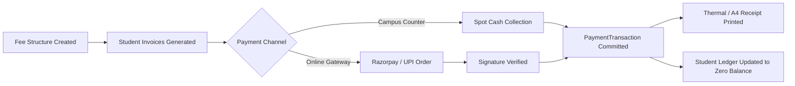
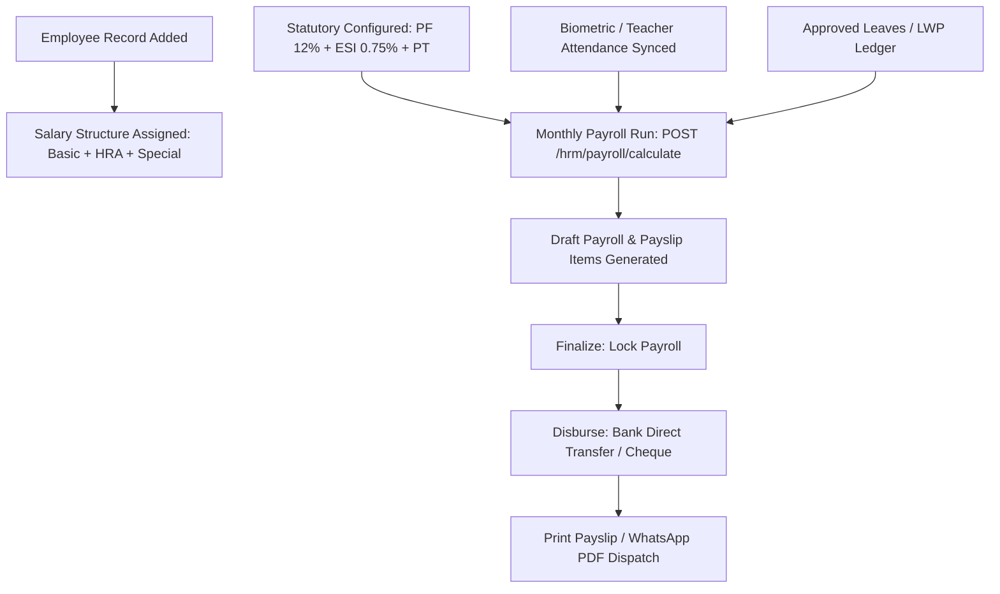

# 🗄️ EduVault — Data Flow, Tenant Boundaries & Entity Relationships

> **Generated:** September 2026  
> **Source Code Trace:** Derived from `EduVaultDbContext.cs`, Entity classes in `EduVault.Core/Entities`, and PostgreSQL schema constraints.

---

## 🏰 Multi-Tenant Boundary Architecture

EduVault enforces strict logical multi-tenancy using shared compute and shared database with column-level tenant partitioning (`SchoolId`). Every operational query in the system automatically restricts its scope to the authenticated user's `SchoolId`.

```
========================================================================================
                          GLOBAL CLOUD PLATFORM (Super Admin)
  [PlatformSettings]   [PlatformPlans]   [Subscriptions]   [GlobalPrintTemplates]
========================================================================================
                                     │
                 ┌───────────────────┴───────────────────┐
                 ▼                                       ▼
    ┌─────────────────────────┐             ┌─────────────────────────┐
    │   TENANT: SCHOOL A      │             │   TENANT: SCHOOL B      │
    │   SchoolId: SCH-001     │             │   SchoolId: SCH-002     │
    ├─────────────────────────┤             ├─────────────────────────┤
    │ • School Admin A        │             │ • School Admin B        │
    │ • Teachers Roster A     │             │ • Teachers Roster B     │
    │ • Students Directory A  │             │ • Students Directory B  │
    │ • Classes & Timetable A │             │ • Classes & Timetable B │
    │ • Fee Invoices A        │             │ • Fee Invoices B        │
    │ • Exam Results A        │             │ • Exam Results B        │
    │ • HRM & Payroll A       │             │ • HRM & Payroll B       │
    │ • Library Catalog A     │             │ • Library Catalog B     │
    │ • Reception Visitors A  │             │ • Reception Visitors B  │
    └─────────────────────────┘             └─────────────────────────┘
                 ▲                                       ▲
                 │ ⛔ CROSS-TENANT ACCESS STRICTLY REJECTED ⛔
                 └───────────────────X───────────────────┘
```

> [!IMPORTANT]
> **Strict Tenant Isolation Rule:**  
> A user belonging to `School A` (with token claim `schoolId = SCH-001`) attempting to read, update, or delete any record belonging to `School B` (e.g. `/api/academics/students/{id}`) is immediately intercepted at the controller layer and rejected with HTTP `403 Forbidden` or `404 Not Found`.

---

## 🧩 Master Entity Relationship Diagram (ERD)

```mermaid
erDiagram
    PLATFORM_SETTING ||--o{ SCHOOL : configures
    SCHOOL ||--o{ SUBSCRIPTION : holds
    SCHOOL ||--o{ USER : employs_and_enrolls
    SCHOOL ||--o{ CLASS : organizes
    SCHOOL ||--o{ SUBJECT : teaches
    SCHOOL ||--o{ FEE_STRUCTURE : bills
    SCHOOL ||--o{ PRINT_TEMPLATE : formats
    SCHOOL ||--o{ DEPARTMENT : structures
    SCHOOL ||--o{ EMPLOYEE : hires
    SCHOOL ||--o{ BOOK : catalogs
    SCHOOL ||--o{ VISITOR_ENTRY : logs
    SCHOOL ||--o{ ADMISSION_INQUIRY : receives

    USER ||--o| TEACHER : profiles_as
    USER ||--o| STUDENT : profiles_as
    USER ||--o| ACCOUNT_MANAGER : acts_as

    CLASS ||--o{ SECTION : contains
    CLASS ||--o{ ENROLLMENT : registers
    CLASS ||--o{ TIMETABLE_ITEM : schedules
    CLASS ||--o{ EXAM : tests

    TEACHER ||--o{ TIMETABLE_ITEM : instructs
    TEACHER ||--o{ ATTENDANCE : records
    TEACHER ||--o{ LEAVE_REQUEST : submits

    STUDENT ||--o{ ENROLLMENT : placed_in
    STUDENT ||--o{ ATTENDANCE : marked_in
    STUDENT ||--o{ STUDENT_INVOICE : charged
    STUDENT ||--o{ EXAM_RESULT : scores
    STUDENT ||--o{ LIBRARY_TRANSACTION : borrows
    STUDENT ||--o{ GATE_PASS_ENTRY : exits_with

    STUDENT_INVOICE ||--o{ PAYMENT_TRANSACTION : settled_by
    EXAM ||--o{ EXAM_RESULT : grades

    EMPLOYEE ||--o{ SALARY_RECORD : earns
    EMPLOYEE ||--o{ PAYROLL_ITEM : itemized_in
    PAYROLL ||--o{ PAYROLL_ITEM : dispatches
```

---

## 📊 Core Data Dependencies & Lifecycles

### 1. The Student Lifecycle Flow
1. **Inquiry / Lead:** Parent submits public admission form (`/apply/:schoolCode`) or receptionist logs walk-in inquiry (`AdmissionInquiries`).
2. **Review & Status Transition:** Receptionist / School Admin moves status (`NEW` → `CONTACTED` → `VISITED` → `ADMITTED`).
3. **Enrollment Mutation:** On click "Enroll", backend executes atomic transaction:
   - Creates `User` with role `'student'` and generated email/password hash.
   - Creates `Student` linked to `User.Id` and `SchoolId`.
   - Generates initial `Enrollment` in selected `Class` and `Section`.
   - Automatically generates initial `StudentInvoice` based on active `FeeStructure` for that class.
4. **Day-to-Day Operations:**
   - Teacher marks daily presence in `Attendances`.
   - Teacher inputs grades into `ExamResults`.
   - Librarian issues books tracked in `LibraryTransactions`.
   - Parent pays fee dues resulting in `PaymentTransactions`.
5. **Clearance & Graduation (TC):**
   - Admin triggers `students/:id/clearance-check`.
   - System aggregates sum of unpaid `StudentInvoices` and count of unreturned `LibraryTransactions`.
   - If clean (balance = 0), admin issues Transfer Certificate (`TransferCertificate` print template) and student status is archived to `Alumni`.

---

### 2. The Fee Billing & Payment Lifecycle Flow


1. **Fee Head Definition:** School Admin or Account Manager creates fee head (`FeeStructure` e.g. "Term 1 Tuition Fee - ₹15,000", Due: 10th Oct).
2. **Invoice Generation:** Invoices are either generated in bulk during session setup or on-demand for students.
3. **Payment Collection:**
   - **Parent / Student Portal:** Student views invoice on `/student/fees`, clicks "Pay Online". Endpoint `POST /api/billing/create-order` returns Razorpay order ID. Parent pays via UPI/Cards. Verification endpoint validates HMAC signature and updates invoice status to `Paid`.
   - **Counter Desk:** Receptionist / Accountant searches student on `/receptionist/fees` or `/account/billing`, receives cash/cheque, and invokes `POST /api/receptionist/collect-spot-fee`.
4. **Receipt Generation:** Receipt is instantly printed using the school's configured `PrintTemplate` (`FeeReceipt`, 80mm thermal or A4 twin-copy).
5. **Accounting Sync:** Transactions are exportable into Tally ERP format via `GET /api/TallyExport/download-xml`.

---

### 3. The Staff HRM & Payroll Lifecycle Flow


1. **Employee Master:** Staff member registered with department, designation, and joining date.
2. **Compensation Components:** Super Admin or Account Manager configures components (Basic 50%, HRA 20%, Conveyance, Special Allowance) and Statutory Rules (PF Employee 12%, PF Employer 12%, ESI 0.75%, Professional Tax slab).
3. **Monthly Attendance & Leave Sync:**
   - Total month working days (e.g. 30 days).
   - Staff present days, approved leaves (CL/PL), and unpaid leaves (LWP).
4. **Calculation Run:** `POST /api/hrm/payroll/calculate` applies statutory formulas, computes gross earnings, deductions, and net in-hand pay.
5. **Approval & Disbursal:** Account Manager locks payroll (`Finalize`), issues salary payments (`Disburse`), and generates printable payslips.
