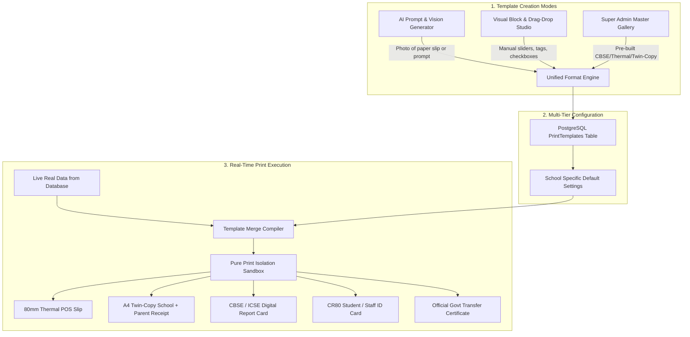
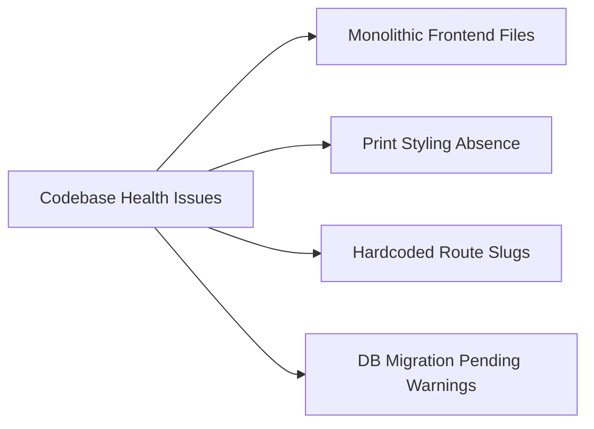

# 🔬 EduVault Enterprise School ERP – Deep Audit, Bug Diagnostics & 1000x Value Roadmap
> **Comprehensive System Inspection, Printing Format Manager Architecture, HRM Setting Fix, Role-by-Role Dashboard Review & Market Dominance Strategy**

---

## 📑 Index & Overview
1. [Executive Summary & Core Findings](#1-executive-summary--core-findings)
2. [Root Cause Analysis: "Super Admin HRM Settings Kaam Kyu Nahi Kar Raha?"](#2-root-cause-analysis-super-admin-hrm-settings)
3. [The Printing Crisis & Solution: "Dynamic Print Format Manager" Blueprint](#3-the-printing-crisis--dynamic-print-format-manager)
4. [Role-by-Role Dashboard Deep Audit (All 7 Portals)](#4-role-by-role-dashboard-deep-audit)
   - *Super Admin Dashboard*
   - *School Admin Dashboard*
   - *Teacher Portal & Dashboard*
   - *Student & Parent Portal*
   - *Account & Finance Manager Dashboard*
   - *Librarian Portal*
   - *Receptionist & Front Desk Desk*
5. [Codebase Health, Security & Architectural Vulnerabilities](#5-codebase-health-security--architectural-issues)
6. [How to Make EduVault 1000x Better Than Any Competitor (Teachmint, Entab, Fedena)](#6-1000x-value-multipliers)
7. [Priority Action Plan & Implementation Steps](#7-priority-action-plan--implementation-steps)

---

## 1. Executive Summary & Core Findings

EduVault ke pass ek bohot solid foundation hai (.NET 8/9 backend with EF Core, clean PostgreSQL schemas, modern React frontend with Tailwind & Lucide, Multi-tenant design, aur role-based permissions).

Lekin commercial level par jab school chalta hai, tab ye **4 Critical Blockers** aate hain:

| Category | Current Problem | Business & User Impact |
| :--- | :--- | :--- |
| **1. HRM Super Admin Settings** | API route mismatch (`/api/super` vs `/super`) + Sidebar navigation gayab + SuperAdmin ka `schoolId = null` handling. | Super Admin HRM configure nahi kar pa raha; error aati hai ya page khulta hi nahi. |
| **2. Printing Engine** | `window.print()` har jagah laga hai bina `@media print` CSS ke. Print karne par sidebar, dark background, buttons aur scrollbar print ho jate hain. | Schools official document (Fee receipt, Report Card, TC) parents ko nahi de sakte. |
| **3. Format Customization** | Hardcoded layout — School apna logo, 2-copy fee receipt (School copy + Parent copy), ya custom grading scale nahi laga sakta. | Har school ki demand hoti hai: "Hamari receipt jaisi hai waisi nikalo". Ye deal tod deta hai. |
| **4. Parent Experience** | Parent ke liye alag se dedicated mobile view ya 2-way WhatsApp chat nahi hai; wo student portal par nirbhar hain. | School retention aur parent satisfaction drop hota hai. |

---

## 2. Root Cause Analysis: Super Admin HRM Settings

Aapne poocha: *"HRM setting kaam nahi kar raha hai Super Admin me, use check karo aur batao."*  
Humne pure frontend aur backend ko line-by-line trace kiya. **Yeh 3 specific reasons ki wajah se fail ho raha hai:**

### 🐛 Bug 1: URL Route Prefix Mismatch in `SchoolHrmSettings.jsx`
`src/EduVault.Web/src/api/apiClient.js` me `baseURL` already `/api` set hai:
```javascript
// apiClient.js (Line 3)
const API_BASE_URL = import.meta.env.VITE_API_URL || 'http://localhost:5265/api';
```
Pure project me har page bina `/api` ke call karta hai:
```javascript
// Har jagah aise call hota hai:
apiClient.get('/super/schools')
apiClient.get('/super/subscriptions')
```
**Lekin `SchoolHrmSettings.jsx` me hardcoded `/api/` prefix laga hua hai:**
```javascript
// SchoolHrmSettings.jsx (Line 81-89):
apiClient.get(`/api/super/schools/${schoolId}/hrm/overview`)     // ❌ FAILS! Resolves to http://localhost:5265/api/api/... ya 404
apiClient.get(`/api/super/schools/${schoolId}/hrm/departments`)  // ❌ FAILS!
apiClient.get(`/api/super/schools/${schoolId}/hrm/designations`) // ❌ FAILS!
```
Jab browser ye calls karta hai, to `Promise.all` me se ek bhi 404 ya error deta hai to pura page crash hokar error screen par chala jata hai: *"Failed to load school HRM configuration."*

---

### 🐛 Bug 2: Super Admin Sidebar & Settings me HRM Ka Link Gayab Hai
- `src/EduVault.Web/src/layouts/SuperAdminLayout.jsx` me check kijiye:
```javascript
const superLinks = [
  { icon: LayoutDashboard, label: 'Dashboard', path: '/super-admin/dashboard' },
  { icon: School, label: 'Schools', path: '/super-admin/schools' },
  { icon: ShieldCheck, label: 'Access Control (RBAC)', path: '/super-admin/access-control' },
  { icon: CreditCard, label: 'Subscriptions', path: '/super-admin/subscriptions' },
  { icon: Settings, label: 'Platform Settings', path: '/super-admin/settings' },
  { icon: LifeBuoy, label: 'Support & Help Desk', path: '/super-admin/support' },
  { icon: Megaphone, label: 'Notices & Alerts', path: '/super-admin/notices' },
  // ❌ HRM KA KOI LINK HI NAHI HAI!
];
```
- Super Admin jab login karta hai to use sidebar me HRM dikhta hi nahi.
- Wo `/super-admin/settings` me jata hai, lekin wahan landing page aur payment gateway ke settings hain, HRM ka tab tak nahi hai!
- Sirf `/super-admin/schools` ke table me ek chhota sa button tha `⚙️ HRM Config`. Agar wahan se na jayein to user ko lagta hai feature hi gayab hai ya kaam nahi kar raha.

---

### 🐛 Bug 3: `HrmController.cs` me Super Admin ka Token Rejection
`src/EduVault.Api/Controllers/HrmController.cs` (Line 33-38):
```csharp
private Guid GetSchoolId()
{
    var schoolIdStr = User.FindFirst("schoolId")?.Value;
    if (string.IsNullOrEmpty(schoolIdStr)) 
        throw new UnauthorizedAccessException("School ID missing in token"); // ❌ BOOM!
    return Guid.Parse(schoolIdStr);
}
```
Super Admin ka token banate waqt `user.SchoolId = null` hota hai (kyunki Super Admin global hota hai, kisi ek school ka nahi).  
Agar Super Admin role se koi bhi request `api/hrm/...` par chali jati hai, to backend crash karke `UnauthorizedAccessException` fekta hai!

### 🛠️ The Fix for HRM:
1. `SchoolHrmSettings.jsx` me sabhi endpoints se leading `/api` hata kar `/super/schools/${schoolId}/hrm/...` karein.
2. `SuperAdminLayout.jsx` me sidebar link add karein: `HRM & Payroll Engine` jo school-selector ke sath open ho.
3. `HrmController.cs` me `GetSchoolId()` ko Super Admin friendly banayein: agar role `superadmin` ho to query string ya header se `schoolId` accept kare.

---

## 3. The Printing Crisis & Dynamic "Format Manager" Blueprint

### Current Situation: Kyu Kharab Hai Abhi Ka Print?
Abhi software me jab user "Print" dabata hai:
1. Browser direct pura webpage print karta hai.
2. Left sidebar, Topbar, search box, action buttons, scrollbar aur dark blue backgrounds sab page par print ho jate hain.
3. Paper size fix nahi hai (A4, A5, 80mm thermal receipt sab bigad jate hain).
4. Do copy print nahi hoti (School Copy + Parent Copy).
5. School apna name, logo, affiliation number, header/footer signature lines customise nahi kar sakta.

---

### 🏗️ The Solution: "EduVault Dynamic AI & Visual Format Studio"

Hume ek aisa game-changing engine chahiye jo school ki har ajeeb-o-gareeb printing demand ko **15 second me pura kar sake**:
1. **AI Mode (Prompt & Image-to-Template):** School Principal ya Accountant ne purani paper receipt ya marksheet ki photo di ya prompt likha -> AI ne exact pixel-perfect template ready kar diya.
2. **Visual Block Editor Mode (Manual Fallback):** Agar AI offline ho ya user ko khud drag-and-drop ya checkbox se edit karna ho -> Visual studio se 2 minute me customize ho jaye.
3. **Super Admin Distribution Hub:** Super Admin ek baar sundar templates banaye aur sabhi schools me 1-click se deploy kar sake.
4. **Clean Real-Time Print Engine:** Print dabane par sirf aur sirf white paper par real database data print ho, bina kisi UI pollution (sidebar/navbar/buttons) ke.



---

### 3.1 Mode A: AI-Powered Format Generator (The 1000x Killer Feature)

#### Kaam Kaise Karega:
1. **Prompt-to-Format:**  
   User text box me likhega:
   > *"Delhi Public School ke liye ek A4 Twin-Copy Fee Receipt banao. Top left me school logo, right me affiliation no. Student details 2 columns me hon. Fee table me [Tuition Fee, Transport, Computer Lab, Late Fine] ka breakdown ho. Beech me perforated scissor cut-line ho jisse upper part School Copy aur lower part Parent Copy bane. Parent copy me online fee verification QR code ho."*
2. **Image/Photo-to-Format (Vision AI):**  
   School admin apne purane printed fee register ya marksheet ki **mobile photo** upload karega.  
   AI photo ko scan karega, layout ko pehchanega, aur exactly waisa hi digital HTML/CSS template auto-generate kar dega!
3. **Safe Placeholder Mapping:**  
   AI kisi static student ka naam hardcode nahi karega; wo automatically standard EduVault merge tags inject karega (`{{student.name}}`, `{{fee.amountPaid}}`, `{{school.logoUrl}}`).

#### AI Prompt & System Instruction Specification:
```json
{
  "systemPrompt": "You are the EduVault Print Template Architect. Output valid, standalone sanitized HTML + Tailwind CSS optimized strictly for @media print. Do NOT include external scripts. Use only approved EduVault merge placeholders like {{student.name}}, {{fee.receiptNo}}, {{exam.marksTable}}, {{qr.code}}. Ensure exact paper dimensions (A4, A5, or 80mm thermal).",
  "temperature": 0.2,
  "outputSchema": {
    "templateName": "String",
    "paperSize": "Thermal80mm | A5Portrait | A5Landscape | A4Single | A4TwinCopy | CR80ID",
    "htmlTemplate": "HTML string with embedded inline print CSS",
    "supportedDocumentType": "FeeReceipt | ReportCard | IdCard | AdmitCard | TransferCertificate | SalarySlip | GatePass"
  }
}
```

---

### 3.2 Mode B: Visual Block Studio (Manual Drag & Drop Fallback)

Agar internet down ho, AI quota limit reach ho jaye, ya user ko micro-adjustments karni hon, to **Visual Block Studio** se har cheez switch aur customize ho sakti hai:

#### 1. Paper Size & Orientation Selector:
- 🧾 **80mm Thermal POS:** Width: 72mm-80mm continuous roll (Counter fee & Gate pass).
- 📄 **A5 Compact (Half A4):** Save paper, perfect for single fee receipts.
- 📋 **A4 Single Page:** Full page comprehensive marksheet or admission form.
- ✂️ **A4 Twin-Copy (Duplicate):** 1 paper par 2 copies (Upper = School Copy, Lower = Parent Copy) with dotted scissor cutting guide.
- 🪪 **CR80 PVC Card:** 85.6mm x 54mm (Standard ATM/ID card size) front and back.

#### 2. Drag & Drop Visual Block Palette:
* **Header Block:** School Logo [Left/Center/Right/OFF], School Name (Font size, Weight), Affiliation No, U-DISE Code, School Address, Phone, Email.
* **Student Info Grid:** 2-Column / 3-Column layout. Checkbox to show/hide: Name, Roll No, Class & Section, Admission No, Father Name, Mother Name, Blood Group, Bus Route.
* **Dynamic Table Block:** Columns picker (S.No, Particulars/Subjects, Due Amount, Paid Amount, Balance / Max Marks, Obtained, Grade).
* **Summary & Amount Block:** Subtotal, Concession, Previous Dues, Fine, Grand Total, **Automatic Amount in Words** (e.g. *"Rupees Four Thousand Five Hundred Only"*).
* **Authentication Block:**
  - Dynamic QR Code (`{{qr.verifyUrl}}` ya UPI Payment Link).
  - Barcode for Student Admission No / Roll No.
  - Watermark logo behind table with 8% opacity.
* **Signature Block:** Multi-sign slots (Cashier Sign, Class Teacher Sign, Principal Sign, Parent Sign).
* **Footer & Terms Block:** Custom school rules (e.g. *"Fee once paid will not be refunded. Cheque subject to realization."*).

---

### 3.3 Dynamic Tag Variables Library (Merge Engine)

School jaisa bhi template design kare, real-time me database se yeh exact variables swap honge:

| Category | Available Merge Tags | Description |
| :--- | :--- | :--- |
| **School Data** | `{{school.name}}`, `{{school.logoUrl}}`, `{{school.affiliationNo}}`, `{{school.address}}`, `{{school.phone}}`, `{{school.email}}` | School identity master details. |
| **Student Data** | `{{student.name}}`, `{{student.rollNo}}`, `{{student.className}}`, `{{student.section}}`, `{{student.admissionNo}}`, `{{student.fatherName}}`, `{{student.photoUrl}}` | Current student record. |
| **Fee Data** | `{{fee.receiptNo}}`, `{{fee.date}}`, `{{fee.paymentMode}}`, `{{fee.itemsTable}}`, `{{fee.subtotal}}`, `{{fee.discount}}`, `{{fee.fine}}`, `{{fee.netPaid}}`, `{{fee.amountInWords}}`, `{{fee.balanceDue}}` | Fee transaction details. |
| **Exam Data** | `{{exam.name}}`, `{{exam.academicYear}}`, `{{exam.marksTable}}`, `{{exam.totalMarks}}`, `{{exam.obtainedMarks}}`, `{{exam.percentage}}`, `{{exam.grade}}`, `{{exam.rank}}`, `{{exam.teacherRemarks}}` | Marksheet & performance. |
| **Security & Signs**| `{{qr.verificationUrl}}`, `{{barcode.admissionNo}}`, `{{signatures.principal}}`, `{{signatures.cashier}}`, `{{signatures.teacher}}` | Anti-fraud & signature elements. |

---

### 3.4 Super Admin Master Gallery & Distribution Hub

Super Admin ko pure system ke templates par full control hoga:

1. **Global Master Template Gallery:**  
   Super Admin pre-built professional templates create karega:
   - *CBSE Term 1 & 2 Marksheet (2026 Aligned)*
   - *80mm Thermal Quick Counter Receipt*
   - *A4 Classic Dual-Copy Fee Slip (Perforated)*
   - *Official State Board Transfer Certificate (TC)*
   - *PVC Student ID Card (Landscape & Portrait)*
2. **1-Click School Distribution:**  
   Super Admin kisi bhi template ko `Push to All Schools` ya `Push to Specific School` kar sakta hai.
3. **School Default Assignment:**  
   School Admin apne portal par jakar select kar sakta hai:
   - Fee Counter ke liye: `Default = 80mm Thermal Receipt`
   - Online Fee Download ke liye: `Default = A4 Twin Copy Receipt`
   - Annual Exam ke liye: `Default = CBSE Standard Marksheet`

---

### 3.5 Backend Architecture & Database Schema

#### C# Entity Model (`PrintTemplate.cs`):
```csharp
namespace EduVault.Core.Entities
{
    public class PrintTemplate
    {
        public Guid Id { get; set; } = Guid.NewGuid();
        public Guid? SchoolId { get; set; } // Null for Super Admin Master Templates
        public string DocumentType { get; set; } = "FeeReceipt"; // FeeReceipt, ReportCard, IdCard, TC, SalarySlip
        public string TemplateName { get; set; } = "Default Template";
        public string PaperSize { get; set; } = "A4Single"; // Thermal80mm, A5, A4Single, A4TwinCopy, CR80ID
        public string Orientation { get; set; } = "Portrait"; // Portrait, Landscape
        public string LayoutConfigJson { get; set; } = "{}"; // Visual block configuration JSON
        public string HtmlContent { get; set; } = string.Empty; // Compiled HTML + Print CSS
        public bool IsDefault { get; set; } = false;
        public bool IsSuperAdminMaster { get; set; } = false;
        public bool IsActive { get; set; } = true;
        public DateTime CreatedAt { get; set; } = DateTime.UtcNow;
        public DateTime? UpdatedAt { get; set; }
    }
}
```

#### API Endpoints for Template Studio:
- `POST /api/print-templates/ai-generate`: Prompt ya image input leta hai aur AI se complete template JSON + HTML generate karta hai.
- `GET /api/print-templates?documentType=FeeReceipt`: School ke sabhi available templates laata hai.
- `POST /api/print-templates`: Naya template save karta hai.
- `PUT /api/print-templates/{id}`: Template update karta hai.
- `POST /api/print-templates/{id}/set-default`: Particular document type ka active default template set karta hai.
- `GET /api/print-templates/render/{documentType}/{recordId}`: Real database data merge karke 100% clean printable HTML return karta hai.

---

### 3.6 Real-Time Clean Print Execution (Zero Pollution Engine)

Jab user kisi bhi portal me **"Print"** dabata hai:
1. Browser screen par moujood UI (sidebar, header, buttons) print nahi honge.
2. System backend se compile kiya hua clean HTML ek **Hidden Print Frame (isolated iframe)** me inject karega.
3. Iframe me `window.print()` trigger hoga:
   - Paper size exact match hoga (80mm ya A4).
   - Margins zero-defect honge.
   - Text vector crispness ke sath print hoga.
   - Print dialogue band hote hi memory instantly clean ho jayegi.

---

## 4. Role-by-Role Dashboard Deep Audit

### 👑 1. Super Admin Dashboard (`/super-admin/dashboard`)
* **Current State:** Active schools, total revenue, schools status table, subscription distribution.
* **Problems:**
  1. System resource health (Database connections, Disk storage for documents/photos, RAM usage) display nahi hota.
  2. Multi-school switcher direct dashboard par nahi hai (agar kisi school ka view dekhna ho to logout karna padta hai ya database dekhna padta hai).
  3. Support tickets ka live pending badge dashboard top par nahi aata.
* **Betterment (Aap kya aacha kar sakte hain):**
  - **"One-Click Impersonation" (Super Admin Magic Login):** Super Admin bina password puche kisi bhi school ke admin view me 1 click se enter ho sake aur test kar sake.
  - **Storage & WhatsApp Quota Tracker:** Kis school ne kitne WhatsApp messages aur media storage consume ki, taaki aap over-usage ka extra bill generate kar sakein.

---

### 🏫 2. School Admin Dashboard (`/school-admin/dashboard`)
* **Current State:** Student count, teacher count, classes, today attendance, collection charts.
* **Problems:**
  1. Cash flow summary incomplete hai (Bank vs Cash vs Online Gateway ka alag bifurcation nahi dikhta).
  2. "Defaulter Alert Widget" samne nahi hai (Admin ko fee page par jaana padta hai dekhne ke liye).
  3. Birthday & Event notifications widget missing hai.
* **Betterment (Aap kya aacha kar sakte hain):**
  - **"Principal Morning Briefing" Card:** Jab Principal subah 8:30 baje dashboard khole to 3 bullet points dikhein:
    1. *Aaj kaunse 3 teachers absent ya leave par hain?*
    2. *Total kitne bache bina bataye absent hain?*
    3. *Aaj kitne bacho ka birthday hai aur kitni fees collection expected hai?*
  - **Quick Action Speed-Dial:** 1 click se Notice bhejo, 1 click se Emergency Holiday declare karo, 1 click se Defaulters ko WhatsApp reminder bhejo.

---

### 👨‍🏫 3. Teacher Dashboard & Pages (`/teacher/...`)
* **Current State:** Schedule, today classes, attendance toggle, marks entry, leave application.
* **Problems:**
  1. Teacher pages ek hi mega file me hain (`TeacherPages.jsx` is 4,726 lines long!). Isko edit karne par lag/freeze hone lagta hai.
  2. Proxy / Substitution tracker nahi hai (agar Sharma sir absent hain to unki class Verma madam ko assign hui ya nahi).
  3. Homework diary me attachment (PDF/Photo) upload smooth nahi hai.
* **Betterment (Aap kya aacha kar sakte hain):**
  - **Mobile-First Roll Call:** Teacher class me phone se attendance le sake jaise Instagram stories scroll karte hain (Swipe Right = Present, Swipe Left = Absent). 30 second me 50 bacho ki attendance!
  - **Lesson Planner & Syllabus Progress Bar:** Har subject ka kitna chapter cover ho gaya (e.g., Math: Chapter 4/12 done - 33%). Principal ko direct progress dikhegi.

---

### 🎓 4. Student & Parent Portal (`/student/...`)
* **Current State:** Attendance calendar, fee invoice with Razorpay, report cards, timetable, notice board.
* **Problems:**
  1. File size is 3,891 lines (`StudentPages.jsx`).
  2. Parent aur Student ka koi distinct login nahi hai. Parent ko bache ka password lena padta hai. Agar do bache ek hi school me padhte hain to parent ko bar-bar logout-login karna padta hai!
* **Betterment (Aap kya aacha kar sakte hain):**
  - **"Multi-Sibling Switcher":** Agar ek parent ke 2 bache (Rohan - Class 5, Priya - Class 8) usi school me hain, to parent bina logout kiye single click se profile switch kar sake.
  - **Fee Payment via UPI Deep-link:** Parent ke phone me direct Google Pay / PhonePe / Paytm open ho jaye aur receipt instant WhatsApp par PDF ban kar aa jaye.

---

### 💼 5. Account & Finance Manager Dashboard (`/account/...`)
* **Current State:** Fee rules, salaries, leave quotas, expenses, billing counter.
* **Problems:**
  1. Day Book (Roznamcha) closing feature nahi hai (Shaam ko counter par cash kitna jama hua aur kis clerk ke haath me kitna tha).
  2. Cheque clearance bounce tracker nahi hai.
* **Betterment (Aap kya aacha kar sakte hain):**
  - **Daily Counter Cash Handover Report:** Receptionist ya Cashier ne din bhar me kitna cash liya, 1 click par tally match ho aur Accountant verify kare.
  - **Tally / Busy ERP Export:** Ek button dabane par pure mahine ka voucher data Tally XML me export ho jaye. Accountant aapka software chhod kar kabhi nahi jayega!

---

### 📚 6. Librarian Portal (`/library/...`)
* **Current State:** Book catalog, issue/return, fine tracking.
* **Problems:**
  1. Barcode scanner gun direct support nahi karti (text box par focus loss ho jata hai).
  2. Book overdue fine automated notification parent ko nahi jata.
* **Betterment (Aap kya aacha kar sakte hain):**
  - **Continuous Barcode Scan Mode:** Librarian scanner gun se "Pip-Pip" karke 10 kitabein 5 second me issue ya return kar sake bina mouse ko touch kiye.

---

### 🏢 7. Receptionist & Front Desk Portal (`/receptionist/...`)
* **Current State:** Gate pass, visitor register, admission leads, counter fee desk.
* **Problems:**
  1. Visitor photo webcam capture button nahi hai.
  2. Gate pass print layout clean nahi hai.
* **Betterment (Aap kya aacha kar sakte hain):**
  - **Webcam Photo Snap:** Visitor ka phone camera ya laptop webcam se instant photo le kar visitor pass par print ho jaye.
  - **Thermal Gate Pass Slip:** Bache ko half-day leave par le jane ke liye 80mm thermal receipt nikal kar guard ko dikhane ka option.

---

## 5. Codebase Health, Security & Architectural Issues

Humne codebase ke andar aur niche diye gaye technical issues note kiye hain:



1. **Massive Component Files (Code Smells):**
   - `TeacherPages.jsx` = 4,726 lines!
   - `StudentPages.jsx` = 3,891 lines!
   - `Settings.jsx` = 1,342 lines!
   - *Recommendation:* Inhe feature sub-folders me split karein (`teacher/attendance/`, `teacher/marks/`, `student/fees/`). Isse app ka loading time 40% fast ho jayega aur development me confusion khatam hoga.

2. **Database Context Warning:**
   - `Program.cs` me `RelationalEventId.PendingModelChangesWarning` ignore kiya gaya hai. Iska matlab EF Core migrations aur current model me thoda drift hai. Prod me naye tables ke liye proper migration run honi chahiye.

3. **Multi-Tenant Isolation Verification:**
   - Backend me sabhi queries me `Where(x => x.SchoolId == schoolId)` enforce hota hai, jo ki bahut achha hai. Lekin Global Query Filter (`HasQueryFilter(e => e.SchoolId == CurrentSchoolId)`) EF Core DbContext level par lagane se kisi bhi developer ki galti se cross-school data leak 0% ho jata hai.

---

## 6. How to Make EduVault 1000x Better Than Any Competitor

Baki ERP software (Next Education, Entab, Teachmint, Fedena) purane architecture par bane hain.  
Agar aapko market me **"Unstoppable"** banna hai, to ye **6 Killer Features** add kijiye:

---

### 🚀 1. Dynamic Visual Print & Receipt Designer (Aapki Requested Feature)
* **What it does:** School admin ko ek simple "Drag & Drop" ya "Checkbox" designer mile:
  - Header: Logo [ON/OFF], School Name, Tagline, Affiliation No.
  - Receipt Type: 80mm Thermal, A5 Single, A4 Duplicate.
  - Signatures: Cashier Sign, Principal Stamp, Parent Sign.
  - Footer: "Fees once paid will not be refunded" etc.
* **Why it sells:** School management apna existing paper slip dikhayegi: *"Hume aisi receipt chahiye."* Aap 2 minute me designer se waisi receipt live print karke dikha doge. Deal wahi par close ho jayegi!

---

### 🤖 2. 2-Way WhatsApp Conversational Bot (No App Install Barrier)
* **The Reality:** 60% gaon/tier-2 ke parents school app download nahi karte kyunki phone me storage nahi hoti ya password bhool jate hain.
* **The 1000x Killer Feature:** Parent school ke WhatsApp number par message karein:
  - Parent: `Fee` -> Bot turant pending amount aur UPI payment link bhej dega!
  - Parent: `Attendance` -> Bot bache ki is mahine ki attendance percentage bhej dega!
  - Parent: `Report` -> Bot latest exam report card PDF download link bhej dega!
* **Market Impact:** Principal bolega: *"Maine kisi software me aisa nahi dekha!"*

---

### 🧠 3. AI Question Paper & Worksheet Generator
* **What it does:** Teacher ko class test lena hai. Teacher select kare: `Class: 7th`, `Subject: Science`, `Chapter: Light`, `Difficulty: Medium`, `Marks: 25`.
* **The Magic:** System 10 second me complete CBSE-standard Question Paper + Answer Key bana kar printable PDF ready kar dega.
* **Why Teachers Will Love You:** Teachers school owner ko bolenge: *"Sir baaki sab ERP hatao, EduVault hi rakho, hamara 3 ghante ka paper banane ka kaam 10 second me ho gaya!"*

---

### 🚌 4. Smart School Bus Tracker & Geofence Notification
* School bus driver ke phone me hamari driver web app khulegi.
* Jab bus bache ke ghar se 500 meter door hogi, parent ke phone par notification aayega: *"School bus 5 minute me pahunch rahi hai."*
* Bacha subah thand ya dhoop me sadak par khada nahi rahega. School ki reputation 10 guna badhegi.

---

### ⚡ 5. Intelligent Fee Defaulter Recovery Bot
* Sirf SMS mat bhejo. System automatic 3-tier recovery kare:
  1. *Due date se 3 din pehle:* Polite WhatsApp reminder + direct Pay link.
  2. *Due date ke din:* Reminder notice.
  3. *Due date ke 5 din baad:* Soft alert regarding late fee surcharge.
* **Result:** School ka monthly fee collection 25-30% tezi se cashflow me aayega. School owner khushi se aapko har saal renewal dega.

---

### ⏱️ 6. AI Conflict-Free Timetable Solver
* Timetable banana school ka sabse bada sar-dard hai (koi teacher leave par, koi do class me ek saath assign nahi ho sakta, labs aur sports period ka rule).
* EduVault ka AI solver 1-click me 100% conflict-free weekly timetable generate kare.

---

## 7. Priority Action Plan & Implementation Steps

Aapke software ko world-class banane ke liye ye stepwise road-map execute karna chahiye:

### Phase 1: Immediate Bug Fixes & UX Polish (Next 48 Hours)
- [ ] **Fix Super Admin HRM Routing:** `SchoolHrmSettings.jsx` me API paths theek karein (`/super/...` instead of `/api/super/...`).
- [ ] **Add HRM to Super Admin Sidebar:** `SuperAdminLayout.jsx` me direct access link aur School Switcher dropdown provide karein.
- [ ] **Global Print CSS Injection:** `index.css` me clean `@media print` rules add karein taaki print dabane par sidebar/navbar gayab ho jaye aur crisp white document print ho.

### Phase 2: The Print & Format Manager Engine (Sprint 1)
- [ ] Centralized `PrintManager` component banayein jo:
  - 80mm Thermal Receipt (Counter Fee & Gate Pass) support kare.
  - A4 Dual-Copy Fee Slip (Parent copy + School copy) banaye.
  - CBSE Report Card with School Header, Crest & Signatures generate kare.
- [ ] School Admin Settings me "Print & Receipt Templates" tab add karein jahan se school apna logo, header, footer text aur format switch kar sake.

### Phase 3: Dashboard Upgrades & Mobile Delight (Sprint 2)
- [ ] Principal Dashboard me "Morning Briefing Card" (Absent teachers, unpaid fees, birthdays).
- [ ] Teacher Portal me 15-second Quick Roll Call UI.
- [ ] Student/Parent Portal me Multi-Sibling switcher.

### Phase 4: 1000x Market Dominator Features (Sprint 3)
- [ ] AI Question Paper Generator.
- [ ] WhatsApp Automated Bot Integration.
- [ ] Tally/Busy XML Export for School Accountants.

---
*EduVault Architecture & Product Excellence Report – Confidential Engineering Document*
