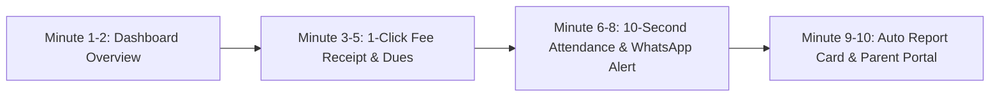

# 🏆 EduVault School ERP – Ultimate Sales & Client Pitch Playbook
> **B2B School Sales Complete Guide: Scripts, Objection Handling, Demo Booking & Closing Strategies**  
> *Language: Practical Hinglish (Hindi + English) for Indian & Global School Markets*

---

## 📑 Table of Contents
1. [Psychology of School Decision Makers (Principal, Chairman, Trustee)](#1-psychology-of-school-decision-makers)
2. [Step 0: Gatekeeper / Receptionist ko Bypass Kaise Karein](#2-step-0-gatekeeper--receptionist-ko-bypass-kaise-karein)
3. [SCENARIO A: Jab School ALREADY Dusra ERP Use Kar Raha Ho (Switching Sale)](#3-scenario-a-school-already-erp-use-kar-raha-hai)
   - *Principal ke Objections & Word-by-Word Counter Replies*
   - *Demo ke liye kaise raazi karein (The "Side-by-Side Comparison" Formula)*
4. [SCENARIO B: Jab School BILKUL ERP Use Nahi Karta (Registers & Excel)](#4-scenario-b-school-erp-use-nahi-karta-traditional)
   - *Unke Darr & Objections aur unka Solution*
   - *ROI Pitch: Kharcha nahi, Paise Bachane aur Kamane ka Tool*
5. [10-Minute Demo Strategy: Demo Me Kya Dikhayein Jo Turant Deal Close Kare](#5-10-minute-demo-strategy)
6. [Pricing & Negotiation Tactics ("Bohot Mehenga Hai" Ka Tod)](#6-pricing--negotiation-tactics)
7. [Live Call Quick Cheat-Sheet (Call ke Dauran Samne Rakhne ke Liye)](#7-live-call-quick-cheat-sheet)

---

## 1. Psychology of School Decision Makers

School me 3 tarah ke log faisla lete hain. Pehle samjho ki kisse kya baat karni hai:

| Decision Maker | Uski Tension (Pain Point) | Usko Kya Sunna Pasand Hai? |
| :--- | :--- | :--- |
| **Owner / Chairman / Trustee** | Paisa, Admission count, Fee defalcation/leakage, School ki Brand Reputation. | "Sir, isse aapki fee recovery 30% fast hogi aur parent complaints zero ho jayengi." |
| **Principal / Vice Principal** | Teachers ka load, Discipline, Timetable clashes, Board exam reports, PTM hassle. | "Madam/Sir, report card banane me jo teachers ke 10 din lagte hain, wo 2 minute me generate honge." |
| **Accountant / Admin Clerk** | Fee receipt kaatna, Defaulter list nikalna, Dues calculate karna, Data entry ka double kaam. | "Aapko registers ya Excel me math nahi lagana padega, 1 click me fee receipt aur auto WhatsApp alert chala jayega." |

> **Golden Rule of Sales:**  
> Kabhi features mat becho (e.g. *"Hamare paas Cloud Database hai"*).  
> **Hamesha Outcome becho** (e.g. *"Sir, aapke phone par raat ko 8 baje 1 click me dikhega ki aaj total kitni fee aayi aur kitna pending hai"*).

---

## 2. Step 0: Gatekeeper / Receptionist ko Bypass Kaise Karein

Schools me direct Principal se baat nahi hoti; receptionist ya peon rokte hain: *"Sir abhi busy hain / Meeting me hain / Number de do hum call karenge."*

### ❌ Yeh Galti Mat Karna:
> *"Hello ma'am, main EduVault se bol raha hu, hum school software bechte hain, kya Principal sir se baat ho sakti hai?"*  
> *(Receptionist turant bolegi: "Hum already software use karte hain, zarurat nahi hai. Thank you.")*

### ✅ Right Approach (Authoritative & Value-Driven):
> **Aap:**  
> *"Good morning ma'am/sir. Main EduVault Academic Tech team se baat kar raha hoon. Actually Principal Sir/Ma'am ke paas academic session ke digital audit and fee automation ke regarding ek brief documentation share karni thi. Kya Sir abhi seat par hain ya 5 minute baad connect karoon?"*

Agar receptionist bole: *"Aap brochure bhej do ya email kar do":*
> **Aap:**  
> *"Bilkul ma'am, main mail bhej deta hoon, lekin mail me Principal Sir ka direct name address karna zaroori hai. Principal Sir ka naam Dr. Verma hai ya Sharma ji? Aur unko mail kis specific matter par review karwayenge? Main directly unhe 2-minute update de deta hoon taaki aapka time waste na ho."*

---

## 3. SCENARIO A: School ALREADY ERP Use Kar Raha Hai

Yeh sabse common scenario hai. 80% ache schools bolenge:  
👉 *"Bhai hamare paas already ERP hai (Entab, Next Education, Teachmint, local vendor, etc.). Hume nahi chahiye."*

### 🧠 Client Ki Psychology:
1. Wo switch karne se darte hain kyunki lagta hai data transfer me mahino lagenge.
2. Unke teachers ne mushkil se purana software seekha hai.
3. Unko lagta hai sab software ek jaise hi hote hain.
4. **Reality:** 90% schools apne current ERP se **pareshan** hote hain kyunki:
   - Support bekar hota hai (call karne par 3 din baad ticket uthta hai).
   - System bohot slow aur complex hota hai.
   - Har choti cheez (e.g., report card format change, custom SMS) ke alag paise mangte hain.
   - Hidden charges hote hain renewal ke time.

---

### 🎙️ The Ice-Breaker Pitch (Pehle 30 Second)

> **Aap:**  
> *"Namaste Sir! Bahut badhiya! Mujhe khushi hui sunkar ki aapka school already digital hai aur aap tech-forward sochte hain. Waise Sir, aap kaun sa ERP use kar rahe hain abhi? XYZ ya koi aur?"*  
> *(Unka naam batane do)*  
>  
> **Aap:**  
> *"Sir XYZ to kaafi purani company hai. Main aapko bilkul nahi bolunga ki aap kal hi software badal lo.  
> Sir, pichle mahine humne 4 aise schools ko EduVault par on-board kiya jo XYZ use kar rahe the. Unka sabse bada issue do cheezon me tha:*  
> 1. *Jab school time me koi issue aaye to local/quick direct WhatsApp support nahi milta.*  
> 2. *Renewal ke time unka bill achanak double ho jata hai aur teachers bolte hain system bohot heavy/slow hai.*  
>  
> *Kya aapko bhi support ya mobile app me thodi dikkat aati hai, ya wahan sab 100% perfect chal raha hai?"*

*(Note: Koi bhi Principal yeh nahi bol sakta ki unka ERP 100% perfect hai. Wo thoda sa dard zaroor ugalte hain).*

---

### 🔥 Top Objections & Word-by-Word Counter Replies

#### Objection 1: "Hamara poora data purane ERP me hai, transfer kaun karega? Data loss ho jayega."
> **Aapka Reply:**  
> *"Sir, yeh aapka bilkul genuine darr hai, koi bhi school data risk nahi le sakta. Lekin humne EduVault me **1-Click Smart Data Importer** banaya hai.  
> Aapke purane software se sirf Excel/CSV download karni hai, aur hamari dedicated technical team **48 hours ke andar** aapka 100% student records, parent details aur fee master migrate karke degi — **Bina ek bhi data miss huye aur bina kisi extra migration charge ke**. Aapko ya aapke staff ko 1 bhi record manually enter nahi karna padega."*

---

#### Objection 2: "Hamare teachers ko naya software seekhne me dikkat hogi. Unhe fir train kaun karega?"
> **Aapka Reply:**  
> *"Sir, purane softwares bulky desktop jaise hote the jisme 50 button hote the jo confuse karte the.  
> EduVault ko humne **WhatsApp aur Swiggy jitna simple** banaya hai. Koi bhi teacher apne smartphone se sirf 3 click me attendance le sakta hai aur report card me marks daal sakta hai.  
> Plus, hum aapke school ko **Free Live Orientation Session** aur har teacher ko **1-minute Hindi video guides** dete hain. 15 minute ke andar aapka har staff member isko smoothly chalane lagega."*

---

#### Objection 3: "Hamara annual contract March/April tak signed hai, abhi beech session me nahi le sakte."
> **Aapka Reply:**  
> *"Sir, main bilkul samajhta hoon. Contract beech me todne ki bilkul zarurat nahi hai.  
> Lekin Sir, March me jab naya session aata hai tab admissions, fee structure aur nayi books ka itna pressure hota hai ki us time naye system ko test karne ka time nahi milta.  
> Hum abhi aapko **Free Staging Sandbox Demo Access** de dete hain. Aap aur aapke admin team 10 minute dekh lijiye. Agar pasand aaye, to implement hum session end par hi karenge. Kam se kam aapke paas ek better aur cost-effective alternative ready rahega."*

---

#### Objection 4: "Aap me aisa kya alag hai jo unke paas nahi hai?" (The USP Punch)
> **Aapka Reply:**  
> *"Sir, 4 main differences hain jo school owners ko sabse zyada pasand aate hain:*  
> 1. **Ultra Fast Cloud Speed:** *Hamara system bina hang huye mobile par 2 second me khulta hai.*  
> 2. **WhatsApp Direct Updates:** *Parents SMS nahi padhte. EduVault se fee reminder aur report card seedha parent ke WhatsApp/Portal par instant jata hai.*  
> 3. **Transparent Per-User Pricing:** *Koi hidden AMC nahi, koi update charges nahi. Jitne bache utna hi payment.*  
> 4. **Instant Dedicated Support:** *Ticket raise karke 3 din wait nahi karna padta, hamari direct dedicated manager helpline rehti hai."*

---

### 🎯 Demo ke Liye Kaise Razi Karein (Closing for Demo)

> *"Sir, dekhne ke koi paise nahi hain. Main aapko koi contract sign karne ko nahi keh raha.  
> Kal dopahar me 2:30 baje ya 4:00 baje jab aap thoda free hon, main sirf **10 minute** ke liye aapko screen par live dikhaunga ki report card aur fee receipt kaise generate hoti hai.  
> Agar aapko apne current ERP se 10 guna simple aur behtar lage, tab aage baat karenge, warna koi commitment nahi. Kal 2:30 baje comfortable rahega ya 4 baje?"*  
> *(Hamesha **Alternative Close** do: "2:30 ya 4:00", kabhi mat pucho "Demo kab karein?")*

---

## 4. SCENARIO B: School ERP Use NAHI Karta (Registers & Excel)

Yeh wo schools hain jo traditional hain (pen-paper, fee register, Excel, diary notes).

### 🧠 Client Ki Psychology:
1. Wo sochte hain: *"Software lagana matlab faaltu ka kharcha."*
2. Unke staff ko lagta hai unka kaam badh jayega (register me bhi likho, computer me bhi bharo).
3. School owner ko technology se thoda dar lagta hai.
4. **Reality Pain Points:**
   - Har mahine 10-15 din sirf Fee collect karne aur hisaab milane me nikal jate hain.
   - Bohot saare bacho ki fee 3-4 mahine late aati hai kyunki track hi nahi rehta kiski baaki hai.
   - PTM ke time teachers 2 hafte tak raat ko jag-jag kar report cards banate hain.
   - Parents complain karte hain: *"Hume to bataya hi nahi bacha absent tha."*

---

### 🎙️ The Ice-Breaker Pitch (Value & ROI Hook)

> **Aap:**  
> *"Namaste Sir! Main EduVault se baat kar raha hoon. Sir, main aapse koi mehenga software khareedne ki baat karne nahi aaya hoon.  
> Main bas ek simple question puchna chahta hoon:  
> **Aapke school me har mahine fee defaulters se dues recover karne me aur report card banane me office staff ke kitne din lag jate hain?**  
>  
> Sir, aaj har chote se bada school digital ho raha hai kyunki parents ab wahi school choose karte hain jahan unhe professional mobile updates milein.  
> Humne ek aisa system banaya hai jo ek normal register se bhi aasan hai, aur aapke school ki fee collection ko 25-30% fast kar deta hai."*

---

### 🔥 Top Objections & Word-by-Word Counter Replies

#### Objection 1: "Hum bina software ke 15 saal se school chala rahe hain, hume zarurat nahi hai."
> **Aapka Reply:**  
> *"Sir, aapka 15 saal ka experience aur reputation bohot badi baat hai, isiliye parents aap par trust karte hain.  
> Lekin Sir, sochiye aajkal parents Har cheez Google Pay aur WhatsApp par chahte hain. Jab pados ka naya school parents ko unke mobile par automated fee receipt, homework aur daily attendance bhejta hai, to parents ko lagta hai wo school zyada modern hai.  
> Hum aapke purane system ko band nahi kar rahe, balki aapke school ko ek **Brand Image** de rahe hain taaki naye session me aapke admissions 20% badhein."*

---

#### Objection 2: "Yeh to bohot mehenga hoga, hamara itna budget nahi hai." (The ROI Reversal)
> **Aapka Reply:**  
> *"Sir, bilkul sahi baat hai, school chalana waise hi bohot kharche ka kaam hai. Lekin sach bataoon Sir, EduVault par jo kharcha aata hai, wo **ek student ki 1 mahine ki pencil ke kharche se bhi kam** hai (sirf ₹70 se ₹100 per student mahina).  
> Aur faayda kya hota hai?  
> Har school me har mahine kam se kam 5-10% bache fee delay karte hain. Agar 50 bacho ki fee bhi time par aa gayi automated reminder se, to aapka school cashflow instantly smooth ho gaya.  
> Plus, register, paper, fee receipt print karane aur report card printing ka jo saal ka ₹40,000-₹50,000 kharcha hota hai, wo poora bach jata hai. **Yeh kharcha nahi hai Sir, yeh aapke school ke paise bachata hai.**"*

---

#### Objection 3: "Hamare teachers ko computer chalana nahi aata, wo nahi kar payenge."
> **Aapka Reply:**  
> *"Sir, kya aapke teachers WhatsApp use karte hain? YouTube chalate hain?  
> Agar wo WhatsApp chala sakte hain, to wo 100% EduVault chala sakte hain. Isme koi coding ya computer course ki zarurat nahi hai.  
> Attendance lene ke liye sirf bache ke naam ke aage 'P' ya 'A' tap karna hota hai — jaise WhatsApp par message bhejna.  
> Aur Sir, pehle 7 din hamari team aapke teachers ko personally handhold karegi jab tak wo comfortable na ho jayein."*

---

#### Objection 4: "Online data safe rehta hai kya? Delete ho gaya to?"
> **Aapka Reply:**  
> *"Sir, register me to paani gir sakta hai, chori ho sakta hai, ya deewak lag sakti hai.  
> Lekin EduVault **Bank-grade 256-bit Cloud Encryption** par chalta hai. Har raat ko automatic cloud backup hota hai.  
> Agar aapka laptop ya mobile kharab bhi ho jaye, to dusre phone me login karke 1 second me saara data waapas samne aa jayega. Aapka record agle 20 saal tak 100% safe rahega."*

---

### 🎯 Demo ke Liye Kaise Razi Karein (The "Zero-Risk Trial" Offer)

> *"Sir, main keh raha hoon aap bilkul mat kijiye start.  
> Sirf kal 15 minute ke liye main aapke office me aa kar (ya online Google Meet par) aapke samne 1 class ka sample data daal kar dikhaunga.  
> Aap khud apne haath se 1 attendance laga kar aur 1 fee slip generate karke dekhiye. Agar aapko lage ki yeh sach me aapka aur aapke staff ka ghanto ka time bachayega, tab hum baat karenge.  
> Kal subah 11:30 baje milte hain Sir?"*

---

## 5. 10-Minute Demo Strategy

Jab client demo ke liye maan jaye, to **kabhi poora software mat dikhao** (features ki bheed dekh kar wo bore ho jayenge).  
Sirf wo 4 cheezein dikhao jo unke dimaag me current lagayein (**The "WOW" Moments**):



### ⏱️ The 10-Minute Demo Script:

1. **Minute 1–2: Clean Dashboard & School Overview**
   - Dikhayein: *"Sir, yeh raha aapka Principal Control Tower. Total bache kitne hain, aaj kitne bache aaye, aur kitni fee aayi — sab 1 screen par."*
2. **Minute 3–5: Fee Management (The Money Module)**
   - Ek bache ka roll number search karo.
   - Partial payment add karo -> **Instant printable receipt generate karke dikhao**.
   - Defaulter List filter karke dikhao: *"Sir, 1 click me class-wise defaulter list nikal aayi, kiske yahan kitna balance baki hai."*
3. **Minute 6–8: Quick Attendance & SMS/Portal Alert**
   - Teacher Portal kholo mobile view me.
   - Attendance tap-tap karo -> Submit.
   - Dikhayein: *"Jaise hi yahan Absent mark hua, parent ke portal par alert chala gaya."*
4. **Minute 9–10: 1-Click Digital Report Card**
   - Exam marks enter hue -> 1 click par professional CBSE/ICSE styled report card with grades & percentage download ho gaya.
   - *"Sir, jo report card banane me teachers 15 din lagate the, wo system ne 5 second me ready kar diya."*

---

## 6. Pricing & Negotiation Tactics

### Rule #1: Pehle Price Mat Batao
Agar client call start hote hi puche: *"Bhai pehle rate batao kitna loge?"*
> **Aapka Reply:**  
> *"Sir, rate bilkul transparent aur minimal hai, lekin price is baat par depend karta hai ki aapke school me kitne bache hain — 200, 500 ya 1000?  
> Main nahi chahta ki aap kisi aisi cheez ke paise dein jo aap use na karein. Pehle 5 minute me dekh lijiye ki kya yeh aapke school ke liye fit hai, pricing to hum aapke budget ke hisab se tailor-made set kar denge."*

---

### Rule #2: "Bohot Mehenga Hai" Ka Tod (Price Framing)

Kabhi mat bolo: *"Sir ₹50,000 saal ka lagega."* (Sun kar darr lagta hai).  
Hamesha bolo:
> *"Sir, yeh sirf ₹2 se ₹3 per student per day padta hai.  
> Ek student jo school me din me ₹30-₹50 ki padhai karta hai, us par 2 rupay ka digital investment aapke school ki image ko city ke top tier convent schools jaisa bana deta hai."*

---

### Rule #3: Closing Deal (Action-Oriented Push)

Jab Principal impress ho jaye aur bole: *"Hum sochenge / Management se baat karenge."*
> **Aapka Reply:**  
> *"Bilkul Sir, Management se baat karna zaroori hai.  
> Lekin Management ko explain karne ke liye agar aap bolenge to unhe lag sakta hai koi naya kharcha hai.  
> Main ek kaam karta hoon, kal 10 minute ke liye Chairman sir ke saath ek quick presentation arrange kar dete hain. Main unhe exact ROI aur cost-saving samjha dunga. Aur tab tak hum aapke school ka 1 class ka **Free Test Environment** create kar dete hain taaki aap khud dekh sakein."*

---

## 7. Live Call Quick Cheat-Sheet

*(Jab aap phone par ya samne baithe ho, yeh table samne rakhein)*

| Situation / Objection | Aapka Quick 1-Liner Response |
| :--- | :--- |
| **"Already ERP use kar rahe hain"** | *"Great Sir! Waise support aur renewal cost me wahan sab smooth chal raha hai ya thoda delay hota hai?"* |
| **"Data migrate kaise hoga?"** | *"Sir 100% data hamari team CSV se 48 hours me free me migrate karke degi, bina kisi error ke."* |
| **"Abhi session ke beech me nahi badalna"** | *"Bilkul Sir! Abhi test kar lijiye, implement hum session end par hi karenge taaki koi rush na rahe."* |
| **"Bina software ke kaam chal raha hai"** | *"Sir kaam to chal jata hai, lekin har mahine staff ke 10 din aur hazaaron rupaye register-paper me waste hote hain."* |
| **"Staff nahi chala payega"** | *"Sir WhatsApp jitna aasan hai. Agar WhatsApp chala lete hain to 15 minute me seekh jayenge."* |
| **"Bohot mehenga hai"** | *"Sir ek pencil ke kharche se kam — sirf ₹2 per din per student. Aur fee recovery time par hone lagti hai."* |
| **"Demo ke liye kaise bolna hai?"** | *"Sir koi buying commitment nahi hai. Sirf 10 minute ka side-by-side comparison dekh lijiye. Kal 2:30 ya 4 baje?"* |

---

## 8. Post-Call Follow-up WhatsApp Template

Call khatam hote hi 5 minute ke andar Principal/Decision Maker ko WhatsApp bhejo:

```text
Respected [Principal Sir/Ma'am / Name],

Thank you for your valuable time on the call today. 

As discussed, here is a quick 1-minute summary of how EduVault empowers schools like yours:
✅ Instant Fee Collection & Automatic WhatsApp Reminders
✅ 10-Second Digital Attendance & Instant Parent Alerts
✅ Automated Exam Report Cards (CBSE/State Board aligned)
✅ Dedicated Mobile Portals for Teachers, Parents & Admins
✅ 100% Free Data Migration from your existing records/Excel

As decided, looking forward to our quick 10-minute live demonstration on [Date] at [Time].

Warm Regards,
[Your Name]
EduVault School Solutions
📞 [Your Phone Number] | 🌐 [Your Website]
```

---
*EduVault Sales Playbook – Confidential & Proprietary Internal Guide*
